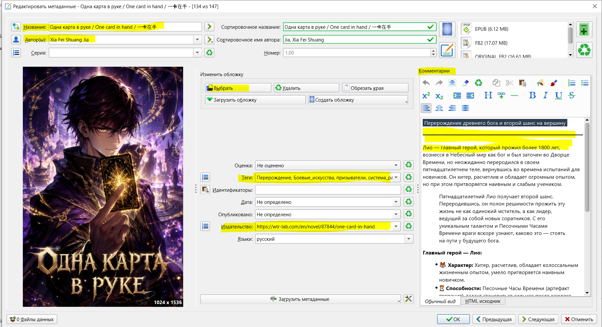

# Руководство по оформлению EPUB-файлов для бота

> 📌 **Важно для авторов и переводчиков:** Чтобы бот корректно распознал книгу, распределил главы, вывел обложку и всю необходимую информацию, метаданные файла `.epub` должны быть заполнены строго по определенным правилам.
>
> Вы можете использовать любой удобный для вас способ подготовки файла: графический интерфейс программы **Calibre** или **прямое редактирование** файлов внутри архива.

## Часть 1. Заполнение метаданных в программе Calibre

1. **Добавление книги:** Откройте Calibre, перетащите ваш `.epub` файл в окно программы, нажмите по нему правой кнопкой мыши и выберите **«Изменить метаданные» → «Изменить метаданные отдельно»**.

2. **Название книги (`Title`):**
   - В поле **«Название»** вы можете указать несколько вариантов, разделив их символом слэша (`/`).
   - *Пример:* `Название на русском / Название на английском / Название на языке оригинала`
   - *Как понимает бот:* Первый элемент до слэша используется как основной заголовок **(ВАЖНО: первое название используется как тема для публикации в группе!! Будьте внимательны!!!)**, остальные учитываются парсером для альтернативных названий в посте.

3. **Автор (`Author`):**
   - В поле **«Автор»** укажите имя автора. Если авторов несколько, разделяйте их запятой.

4. **Теги / Жанры (`Tags`):**
   - В поле **«Метки» (Tags)** перечислите жанры или категории через запятую. Бот автоматически превратит их в хештеги.
   - *Пример:* `Фэнтези, Романтика, Приключения`

5. **Описание / Аннотация (`Comments`):**
   - Введите текст аннотации в поле **«Описание»**. Бот считывает этот блок для формирования описания книги.

6. **Ссылки и Издатель (`Publisher`):**
   - В поле **«Издатель»** укажите ссылку на источник (например https://wtr-lab.com/en/novel/87844/one-card-in-hand). Бот использует первую найденную ссылку, начинающуюся с `http`, для вставки в пост.

7. **Обложка (`Cover`):**
   - Загрузите или выберите обложку в формате JPEG/PNG. Calibre автоматически добавит её в структуру книги.



## Часть 2. Прямое редактирование файлов EPUB

Если вы не используете Calibre, вы можете отредактировать метаданные и структуру книги напрямую.

### 1. Редактирование файла `content.opf`

Откройте файл `content.opf` (обычно находится в папке `OEBPS`) в любом текстовом редакторе и найдите тег `<metadata>`. Заполните поля в соответствии со стандартами Dublin Core (`dc:`):

```xml
<metadata xmlns:dc="http://purl.org/dc/elements/1.1/">
    <!-- Название (несколько вариантов через слэш). ВАЖНО: первое название используется как тема для публикации в группе!!! Будьте внимательны!!! -->
    <dc:title>Название на русском / Название на английском / Название на языке оригинала</dc:title>

    <!-- Автор -->
    <dc:creator>Имя автора</dc:creator>

    <!-- Теги / Жанры (каждый тег в отдельной строке) -->
    <dc:subject>Фэнтези</dc:subject>
    <dc:subject>Приключения</dc:subject>

    <!-- Описание / Аннотация -->
    <dc:description>Здесь пишется подробная аннотация к книге...</dc:description>

    <!-- Ссылка (вставляется в поле издателя/publisher) -->
    <dc:publisher>https://wtr-lab.com/en/novel/87844/one-card-in-hand</dc:publisher>
</metadata>
```

### 2. парсинг обложки и количества глав

- **Обложка (`titlepage.xhtml`):** Убедитесь, что в архиве присутствует файл `titlepage.xhtml`, содержащий ссылку на изображение в теге `<image xlink:href="...">`, либо файл обложки в форматах `.jpg`, `.jpeg`, `.png` (бот проверит их автоматически).

- **Количество глав (`toc.ncx`):** Для подсчета глав бот сканирует файл оглавления с расширением `.ncx` и считает общее количество навигационных элементов (`<navPoint>`). Убедитесь, что файл оглавления присутствует в книге.

